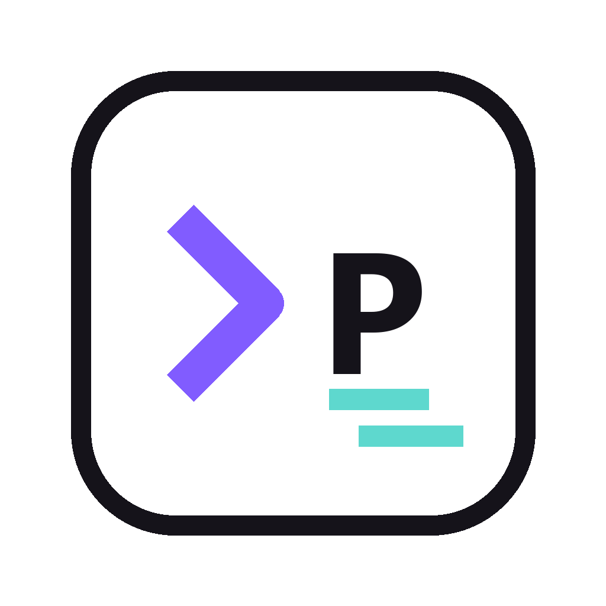
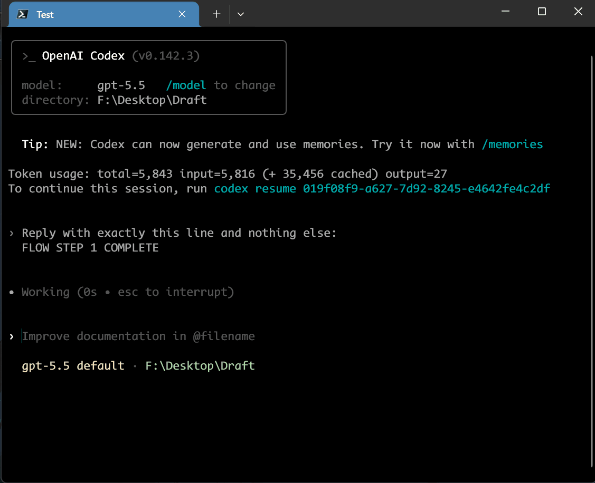
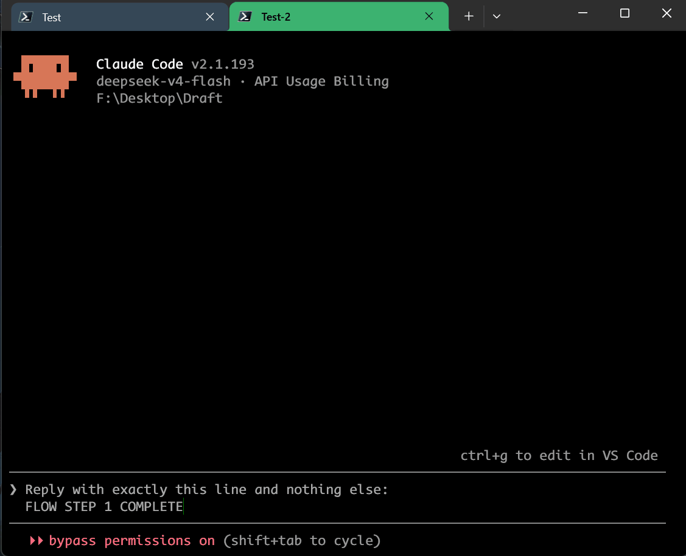

<p align="center">
  
</p>

<h1 align="center">prompt-flow</h1>

<p align="center">
  English · <a href="README.zh-CN.md">Simplified Chinese</a>
</p>

<p align="center">
  <a href="https://github.com/baosen-h/prompt-flow/releases"></a>
  <a href="https://github.com/baosen-h/prompt-flow/releases"></a>
</p>

## Product Introduction

`prompt-flow` is a tiny prompt picker and prompt workflow tool for Codex and Claude Code.

## Demos

<table>
  <tr>
    <th align="center">Codex Flow</th>
    <th align="center">Claude Code Flow</th>
  </tr>
  <tr>
    <td></td>
    <td></td>
  </tr>
</table>

## Usage

1. Download the Windows installer from [Releases](https://github.com/baosen-h/prompt-flow/releases/latest).
2. Open `prompt-flow` to configure prompts and flows.
3. Focus Codex or Claude Code.
4. Press `Ctrl + Alt + P`.
5. Press `Tab` to switch between Prompt and Flow.
6. Search, choose, and press `Enter`.

For flows, install the Codex and Claude hooks from the Flow settings page. Hooks let `prompt-flow` send the next step after the current answer finishes.

## Build

```bash
npm install
npm run tauri:build
```

## Notes

- Web text boxes can use normal prompt insertion, but web does not support flow mode.
