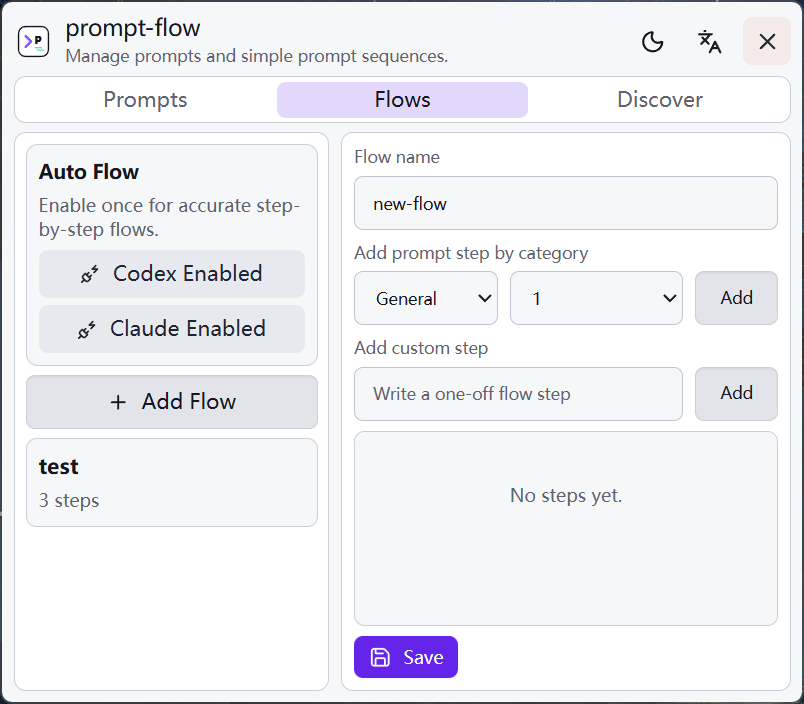

<div align="center">
  <h1>prompt-flow</h1>
  <p><strong>A tiny prompt picker and prompt workflow tool for Codex and Claude Code.</strong></p>
</div>

<p align="center">
  <a href="https://github.com/baosen-h/prompt-flow/releases/latest">Download</a>
  ·
  <a href="#english">English</a>
  ·
  <a href="#中文">中文</a>
</p>

<div align="center">
  
</div>

## English

`prompt-flow` helps you reuse prompts in coding CLIs without leaving the keyboard.

Press `Ctrl + Alt + P`, search your prompt or flow, then insert it into Codex or Claude Code. A flow sends prompts one by one, so you can turn repeated multi-step work into a simple sequence.

### Why

- Fast prompt picker for Codex and Claude Code
- One-shot prompt mode for common prompts
- Flow mode for step-by-step prompt sequences
- Small settings page for prompts, categories, and flows
- Windows tray app: open settings by clicking the app, open picker by shortcut

### Codex Flow

<div align="center">
  
</div>

### Claude Code Flow

<div align="center">
  
</div>

### Settings

<div align="center">
  
</div>

### Usage

1. Download the Windows installer from [Releases](https://github.com/baosen-h/prompt-flow/releases/latest).
2. Open `prompt-flow` to configure prompts and flows.
3. Focus Codex or Claude Code.
4. Press `Ctrl + Alt + P`.
5. Press `Tab` to switch between Prompt and Flow.
6. Search, choose, and press `Enter`.

For flows, install the Codex and Claude hooks from the Flow settings page. Hooks let `prompt-flow` send the next step after the current answer finishes.

### Build

```sh
npm install
npm run tauri:build
```

## 中文

`prompt-flow` 是一个很小的提示词选择器，也可以把多个提示词按顺序组成工作流，主要用于 Codex 和 Claude Code。

按下 `Ctrl + Alt + P`，搜索提示词或工作流，然后插入到当前 CLI。工作流会按顺序发送每一步提示词，适合把重复的多步骤任务变成一次选择。

### 为什么做它

- 给 Codex 和 Claude Code 用的快速提示词选择器
- 普通提示词模式：选择一个提示词直接插入
- 工作流模式：按顺序执行多个提示词
- 简单设置页：管理提示词、分类和工作流
- Windows 托盘应用：点击应用打开设置，快捷键打开选择器

### Codex 工作流

<div align="center">
  
</div>

### Claude Code 工作流

<div align="center">
  
</div>

### 设置页

<div align="center">
  
</div>

### 使用方法

1. 从 [Releases](https://github.com/baosen-h/prompt-flow/releases/latest) 下载 Windows 安装包。
2. 打开 `prompt-flow`，配置提示词和工作流。
3. 聚焦到 Codex 或 Claude Code。
4. 按 `Ctrl + Alt + P`。
5. 按 `Tab` 在 Prompt 和 Flow 之间切换。
6. 搜索、选择，然后按 `Enter`。

如果要使用工作流，请在 Flow 设置页安装 Codex 和 Claude hook。hook 的作用是：等当前回答结束后，再自动发送下一步提示词。

### 构建

```sh
npm install
npm run tauri:build
```
