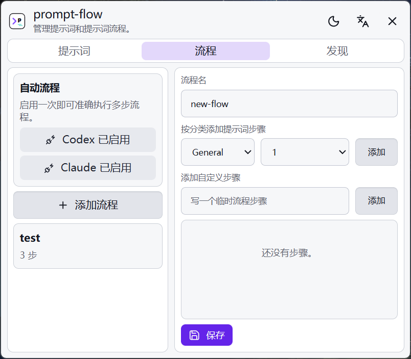

<p align="center">
  
</p>

<h1 align="center">prompt-flow</h1>

<p align="center">
  <a href="README.md">English</a> · 简体中文
</p>

<p align="center">
  <a href="https://github.com/baosen-h/prompt-flow/releases"></a>
  <a href="https://github.com/baosen-h/prompt-flow/releases"></a>
</p>

## 产品介绍

`prompt-flow` 是一个很小的提示词选择器，也可以把多个提示词按顺序组成工作流，主要用于 Codex 和 Claude Code。

按下 `Ctrl + Alt + P`，搜索提示词或工作流，然后插入到当前 CLI。工作流会按顺序发送每一步提示词，适合把重复的多步骤任务变成一次选择。

它的目标是做成一个轻量应用：启动快、选择快，可以在任何需要提示词的地方快速使用，不打断当前工作。

## 演示

<table>
  <tr>
    <th align="center">Codex 工作流</th>
    <th align="center">Claude Code 工作流</th>
  </tr>
  <tr>
    <td></td>
    <td></td>
  </tr>
  <tr>
    <td align="center"><sub>选择一个 Flow，把第一步发送到 Codex。</sub></td>
    <td align="center"><sub>Claude Code 每次回答结束后，继续发送下一步。</sub></td>
  </tr>
  <tr>
    <th align="center" colspan="2">设置页</th>
  </tr>
  <tr>
    <td colspan="2"></td>
  </tr>
  <tr>
    <td align="center" colspan="2"><sub>管理提示词、分类、工作流、语言、主题和 hook。</sub></td>
  </tr>
</table>

## 使用方法

1. 从 [Releases](https://github.com/baosen-h/prompt-flow/releases/latest) 下载 Windows 安装包。
2. 打开 `prompt-flow`，配置提示词和工作流。
3. 聚焦到 Codex 或 Claude Code。
4. 按 `Ctrl + Alt + P`。
5. 按 `Tab` 在 Prompt 和 Flow 之间切换。
6. 搜索、选择，然后按 `Enter`。

如果要使用工作流，请在 Flow 设置页安装 Codex 和 Claude hook。hook 的作用是：等当前回答结束后，再自动发送下一步提示词。

## 构建

```bash
npm install
npm run tauri:build
```

## 说明

- Windows 优先。
- 提示词数据保存在本地。
- 自动工作流目前主要支持 Codex 和 Claude Code。
- 网页文本框可以使用普通提示词插入，但网页不支持 Flow 模式。
